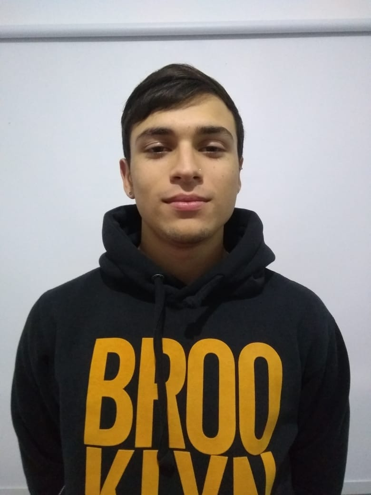

# Gonzalo De Rito

Yo soy Gonzalo de Rito, estudiante de la carrera Tecnicatura en informatica de la UNAHUR.
Curso la materia Programacion por objetos 1 en el turno noche

## **Mi vida educativa

Antes de ingresar a la facultad realice varios cursos de programacion, uno de ellos fue un curso de desarrollo web en la escua Da Vinci donde nos enseñaron a escribir html css y javascrip pero muy por encima, literalmente no se entendia que estabamos haciendo, solo copiabamos al profe, ahora en lo que vengo viendo en la carrera me enseño mucho a entender a programar de verdad y tener las bases para cualquier lenguaje.

## **Hobbies 

soy productor musical ademas de estudiante de informatica, y en mis tiempos libres suelo producir beats y crear canciones e incluso a crear beats para otros artistas. 
Ademas me encanta hacer deporte como ir al gym y jugar a la pelota con amigos.

